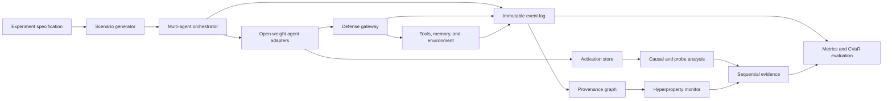

# System Architecture

## 1. Architectural objective

One shared harness should support all four experiments. The correct abstraction is an event-sourced multi-agent security laboratory, not a benchmark tied to a particular steganographic scheme or agent framework.

The system must support:

- homogeneous and heterogeneous open-weight agents;
- deterministic replay where feasible;
- paired counterfactual interventions;
- activation capture and patching;
- message, memory, tool, topology, and action interventions;
- immutable event history and provenance;
- online and offline defenses;
- long-running stochastic episodes;
- consistent security and utility evaluation.

## 2. High-level architecture

## 3. Experiment specification

The specification is the immutable input to an episode. It contains:

- model and adapter versions;
- agent roles and system prompts;
- scenario and task identifier;
- attack strategy;
- defense stack;
- Section 3.3 dimension settings;
- topology;
- observability configuration;
- intervention plan;
- random seeds;
- stopping conditions;
- output and privacy policy.

The resolved specification should be stored with every result so an episode can be reproduced or audited.

## 4. Multi-agent orchestrator

The orchestrator owns execution order and environment synchronization. It must support:

- synchronous turns;
- asynchronous event queues;
- directed and broadcast communication;
- configurable topologies;
- agent creation and removal;
- delayed messages and triggers;
- maximum token, step, and tool budgets;
- defense decisions that allow, transform, delay, block, or escalate events.

The orchestrator should not contain scenario-specific security logic. It executes protocols and emits events; scenarios and defenses define semantics.

## 5. Agent adapter

The agent adapter provides one interface over local model runtimes.

Required capabilities:

- format observations into model input;
- generate actions and messages;
- expose token probabilities when available;
- capture selected hidden states;
- apply activation patches;
- load model-specific prompt or LoRA configurations;
- enforce token and compute budgets;
- return structured outputs without hiding the original model response.

The adapter must record the precise model, tokenizer, revision, quantization, sampling parameters, and adapter state.

## 6. Defense gateway

The defense gateway is the complete-mediation point for observable inter-agent and agent-environment activity.

It exposes hooks before and after:

- messages;
- tool calls;
- tool results;
- memory reads and writes;
- environment actions;
- high-impact or irreversible actions.

A defense decision can:

- allow;
- transform;
- redact;
- rate-limit;
- request another agent’s approval;
- quarantine an agent or artifact;
- block;
- terminate the episode.

The gateway composes multiple defenses in a declared order. Ordering matters: for example, a mediator may transform a message before a detector observes it, or the system may intentionally record both pre- and post-mediation representations.

## 7. Event model

Every relevant interaction becomes an immutable event.

Minimum fields:

- event and episode identifiers;
- logical and wall-clock timestamps;
- actor, recipient, model, and role identifiers;
- event kind;
- parent event identifiers;
- payload or payload reference;
- policy and authorization metadata;
- security classification;
- reversibility and impact metadata;
- defense decisions;
- activation reference;
- environment state before and after, when applicable.

Parent identifiers create a provenance DAG. Payloads containing sensitive data should be encrypted, redacted, or stored by reference according to the experiment policy.

## 8. Activation store

Activations are too large for the event database. Store them separately using content-addressed references.

The store should support:

- layer and token selection;
- configurable precision;
- pooling or projection for routine experiments;
- exact tensors for intervention subsets;
- links to event, model, token span, and forward-pass identifier;
- deletion and retention policies.

Activation capture must be treated as sensitive. It can encode private inputs and may create a new attack surface.

## 9. Provenance graph

The provenance graph is derived from events rather than manually assembled.

Node examples:

- agent invocation;
- message;
- retrieved artifact;
- memory record;
- tool call;
- generated artifact;
- authorization decision;
- environment action;
- external sink.

Edge examples:

- generated-by;
- received-by;
- derived-from;
- read-from;
- wrote-to;
- authorized-by;
- executed-by;
- affected.

The graph supports coalition enumeration, causal path queries, attack localization, separator discovery, and cascade metrics.

## 10. Intervention system

Interventions must be first-class objects rather than ad hoc experiment code.

Initial intervention types:

- secret replacement;
- message removal or replacement;
- sender or receiver substitution;
- activation patching;
- memory deletion or replacement;
- topology edge removal;
- tool-result substitution;
- authorization policy change;
- attack-onset change.

Each intervention declares:

- target;
- application time;
- value or source episode;
- expected invariants;
- provenance annotation.

Paired execution should verify that non-target configuration remains equivalent.

## 11. Online analysis pipeline

Online defenses consume events and emit scores or decisions.

The pipeline can include:

1. message and schema validation;
2. task-scope enforcement;
3. activation probe scoring;
4. provenance and policy updates;
5. coalition residual computation;
6. sequential evidence update;
7. risk-dependent action gating;
8. circuit-breaker or isolation response.

Not every experiment enables every stage. Ablations should be able to remove one layer without changing the scenario.

## 12. Offline analysis pipeline

Offline analysis performs expensive operations unsuitable for runtime:

- paired causal estimation;
- activation patch sweeps;
- optimal or adversarial decoder training;
- exhaustive coalition enumeration;
- graph separator comparison;
- distribution-shift evaluation;
- CVaR and confidence-interval estimation;
- replay under alternative defense configurations.

## 13. Security boundaries

The harness itself must not be trusted merely because it is a research tool.

Required boundaries:

- sandbox all tool execution;
- use synthetic secrets and targets;
- deny external network access by default;
- separate model-generated code from the host process;
- enforce resource and step budgets;
- log all defense and authorization changes;
- prevent agents from modifying experiment specifications;
- treat stored prompts, activations, and traces as sensitive.

## 14. Deployment mapping

The same conceptual components map to a real system:

| Research harness | Deployment equivalent |
|---|---|
| Experiment specification | Deployment manifest and policy bundle |
| Agent adapter | Model or agent-runtime integration |
| Orchestrator | Workflow engine or agent platform |
| Defense gateway | Service mesh, policy enforcement point, or agent firewall |
| Event log | Distributed tracing and audit telemetry |
| Provenance graph | Data and execution lineage service |
| Intervention system | Replay, canary, quarantine, and policy simulation |
| Sequential evidence | Streaming risk monitor |
| Action gate | Approval workflow or capability controller |

The transferable product is therefore the instrumentation, policy, experimentation, and optimization framework—not one frozen activation classifier.
